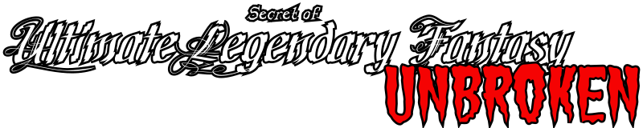

# SoulFu (Secret of Ultimate Legendary Fantasy UNBROKEN)

> SoulFu was created by Aaron Bishop, who established the foundation for a distinctive 3D action‑RPG dungeon crawler. This project focuses on preservation and continuation. Through targeted maintenance, bug fixes, restoration work, and thoughtful improvements to the existing systems, we aim to keep SoulFu functional, enjoyable, and true to its original spirit — unbroken.

---

## FAQ

<strong>Wasn't it called UNLEASHED?</strong>

Yes, you're right! 20 years ago the title ended with “UNLEASHED.”
We chose a title that reflects the current state and direction of the revived codebase. “UNBROKEN” captures that idea: despite the decades that have passed and the game’s unfinished nature, its core gameplay has endured and remains fully playable today. It is a testament to its resilience and to the work invested into keeping it alive.

<strong>Does SoulFu run on my system / console / PC?</strong>

Most likely, yes!  
We are working on providing official-ish release candidates.  
Until then, check our wiki for detailed instructions on how to build SoulFu yourself.

<strong>How can I contribute?</strong>

1. Fork the repository.  
2. Implement your idea. If you add multiple features, it's best to create a separate branch for each one.  
3. Open a new pull request.  
4. If the changes fit the project direction, they will be merged. If not, no worries — you can continue developing your own fork.

Any help is appreciated: programmers, level designers, 2D/3D artists, translators, testers, and more.  
If you're unsure where to start, feel free to join our Matrix channel: **[#soulfu:matrix.org](https://matrix.to/#/#soulfu:matrix.org)**

---

## Building the game

See [packaging/README.md](packaging/README.md) for full instructions on building from source.

## What has been done till now?
+ Tools for handling **datafile.sdf** (the archive where all game data is stored) have been implemented. Maybe they are not of the highest quality, but they get work done. To be precise:
  + data packer/unpacker,
  + 3D model converter,
  + language file converter,
  + script compiler.
+ A few mods have been merged:
  + Squire AI by Poobah *[note: AI has been largely modified since the original release of Poobah's AI]*,
  + Mana Regeneration by Xuln *[note: it has been extended to Apprentices]*,
  + Saving System by Xuln *[note: some issues leading to loss of game progress have been fixed]*,
  + [Sky Box](../../wiki/Mods:-Skybox) by MiR,
  + Arena by bravebebe.
+ 64 bit platform support
+ As noted above, AI has been improved significantly. Your helpers can now fight a bit better against bumpy enemies (like rats or slimes). Apprentices can cast spells in an intelligent manner. Some TALK commands are implemented, e.g. hold your ground, charge, follow, go to the nearest door. The work is in progress, so expect even more changes.
+ Background music has been enabled. It was already there, composed by Aaron.
+ Support for resolutions up to 1920x1080. No stretching, no black stripes.
+ Rough translation to French, German, Italian and Spanish made with DeepL. Polish translation is much better as I speak Polish natively. Polish language-specific font characters have been added. Not all text has been translated, though.
+ Elf has been rebalanced. The initial HP, strength and intelligence have been lowered. Taming, especially mountable monsters, is easier. The bow equipped initially by Elf is magical.
+ Some bug fixing has been done around G'nome Copter. Now it can be built by G'nome at intelligence of 30.
+ Port to SDL2.
+ Joystick support up to 16 buttons. The limit was 8 in the original and it made impossible to map controls to some buttons on modern gamepads.

## What could be done?
I do not promise anything as the project is done in my free time. I have some ideas, though:
+ avoid recompilation of unchanged scripts by the script compiler,
+ a standalone room editor,
+ conversion of 3D models along with skeletal animation data,
+ proper translation - add language-specific font characters, translate books and monster names, etc.
+ network game - Aaron wrote a bunch of code for this feature, so I guess it could be made usable with relatively little effort,
+ port to platforms other than PC,
+ a new spell Drain - Aaron left some notes and an image (=ODRAIN.PCX), so maybe it could be finished,
+ new areas - judging from music files Aaron left, he had in mind designing Airship, Desert, Forest and Mountain areas,
+ even better AI - Apprentices could use a Gonne (G'nome's gun) and open chests or doors on demand, Kittens/Puppies could stop drowning so easily, heart collection AI could be refactored and extended to other characters, etc.
+ new weapons - maybe a spear, a trident?

But it's easier said than done.

Take a look at the [Master To Do List](../../wiki/Development:-Master-To-Do-List) for even more ideas by Aaron himself.

## Trivia
+ Build with DEVTOOL flag to enable development tools inside the game. Hold down the C key to make a relevant button appear.
+ Luck gives you bonus to money and damage. You can find better stuff in chests, too.
+ Fortune cookies bring you luck.
+ Soldier can have one extra companion.
+ Mystic can turn undead by praying.
+ D'warf is immune to poison and petrification,
+ Successful taming requires three things - Tripe, high max HP of tamer and low HP of monster. Hit the monster a few times to soften it.
+ Unholy weapons make you hungry faster.
+ The spell Levitate can be used to create flying weapons.
